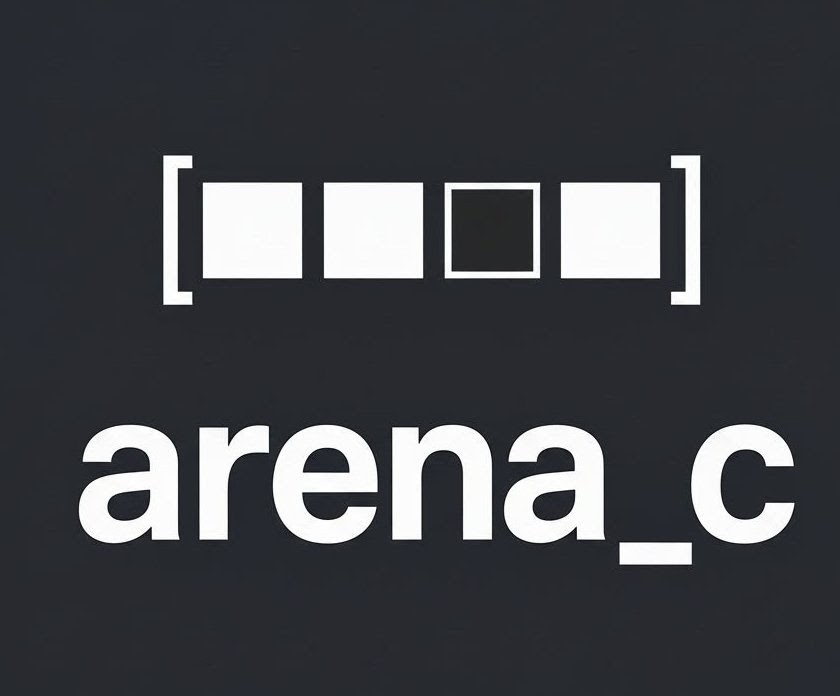
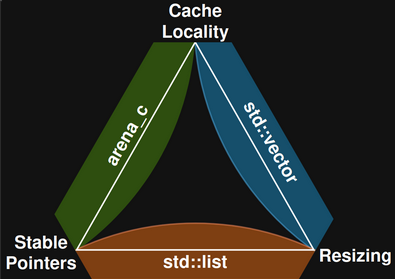
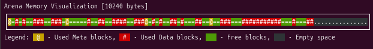

<div>
  

  <div style="padding-top: 10px;">
    <h1 style="margin-bottom: 0; margin-top: 0;">
      Header-Only Arena-Based Memory Allocator in C
    </h1>
    <!-- Look ma, I added badges! Now my toy is a "serious project"! -->
    <p style="margin-top: 15px; margin-bottom: 5px;">
      <a href="https://opensource.org/licenses/MIT">
        
      </a>
      <a href="https://www.codefactor.io/repository/github/gooderfreed/arena_c">
        
      </a>
      <a href="https://codecov.io/gh/gooderfreed/arena_c">
        
      </a>
      <a href="https://github.com/gooderfreed/arena_c/actions/workflows/ci.yml">
        
      </a>
    </p>
    <!-- There. Shiny enough? Now let's get back to actual work. -->
    <p>
      <b>An efficient, portable, and easy-to-use header-only arena-based memory allocator library written in pure C.</b>
    </p>
  </div>
</div>

## TL;DR

**What is it?** A high-performance, portable, header-only arena allocator for C.

**Key Features:**
*   **O(log n) Free List:** Uses a Left-Leaning Red-Black Tree for efficient block reuse and low fragmentation.
*   **Minimal Overhead:** Only 32 bytes of metadata per block, achieved with advanced techniques like pointer tagging and binary-compatible struct layouts.
*   **Bump Sub-allocators:** Includes high-speed bump allocators with support for guaranteed memory alignment (`bump_alloc_aligned`).
*   **Safe by Design:** Features compile-time assertions for configuration and runtime checks for overflow and pointer validity.

**Why use it?** To get fast, controlled, and reliable memory management in performance-critical applications like game engines, embedded systems, or network servers.

**How to use it?** `#define ARENA_IMPLEMENTATION` in one `.c` file, then just `#include "arena.h"`.

This library serves as the core memory manager for the [Zen Framework](https://github.com/gooderfreed/Zen) - a lightweight, modular framework for building console applications in C. The arena allocator provides efficient memory management for Zen's component-oriented architecture and interactive features.

## Overview

This library provides a header-only implementation of an arena-based memory allocator in C. Arena allocation is a memory management technique that allocates memory in large chunks (arenas) and then subdivides them for application use, which can offer significant performance benefits in scenarios with frequent allocations.

This implementation is designed with a focus on **performance, memory efficiency, and flexibility**, providing advanced features like nested arenas and bump sub-allocation within a robust, portable package.

**Key Benefits:**

*   **High Performance:** Fast allocations with O(log n) complexity for finding free blocks (via an LLRB-Tree) and O(1) for most tail allocations.
*   **Memory Efficiency:** Minimized metadata overhead and reduced memory fragmentation.
*   **Flexible Sub-allocation:**
    *   **Nested Arenas** for hierarchical memory management (`arena_new_nested`).
    *   **Bump Allocators** for extremely fast, zero-overhead allocation of many small objects (`bump_new`).
*   **Fine-grained Control:** Supports freeing individual blocks (`arena_free_block`) for memory reuse, in addition to fast full-arena resets.
*   **Source-Agnostic API:** The core functions operate on an `Arena*` handle, making them independent of the memory source. This allows for easy switching between static and dynamic arenas without altering the allocation logic.
*   **Simplicity:**  Easy to integrate into C projects as a header-only library.

## Recommended Use Cases

This library provides a flexible, high-performance alternative to standard `malloc`/`free` for a wide range of applications. It excels in scenarios requiring:
*   **High-throughput Allocations:** In systems that perform a large number of allocations and deallocations, such as game engines, network servers, or custom data structures. The O(1) tail allocation and bump sub-allocators are ideal for this.
*   **Controlled Memory Lifecycles:** When you can group objects into scopes and deallocate them all at once (e.g., per-frame data, per-request state, parsing a file). This is the classic arena use case, and it's extremely fast.
*   **Reduced Memory Fragmentation:** For long-running applications where standard allocator fragmentation can become a problem. The block-merging strategy helps keep the memory pool healthy.
*   **Fine-grained Memory Management:** When you need more control than `malloc` offers, but want to avoid writing a full custom allocator. The combination of individual `free`, bump allocators, and nested arenas provides a powerful toolkit.
*   **Simplified Multithreading:** In parallel systems using a "one-allocator-per-thread" model. The `arena_new_nested` function makes this pattern safe and easy to implement without locks.

## Features

*   **Extreme Portability:** Header-only and continuously tested on a vast matrix of platforms, including Linux, macOS, and Windows; x86_64, x86_32, ARM64, and ARM32 architectures; and both **Little Endian and Big Endian** byte orders.

*   **Full C++ Compatibility:** Wrapped in `extern "C"` for seamless integration into C++ projects.

*   **Flexible Arena Creation:**
    *   **Static Arena:** Use pre-allocated memory (stack, global buffer).
    *   **Dynamic Arena:** Allocate the arena's memory from the heap.
    *   **Nested Arenas:** Safely create sub-arenas within a parent, ideal for thread-local storage.

*   **Advanced Allocation Strategies:**
    *   **General-Purpose Allocation:** An efficient free-list allocator with O(log n) performance using an LLRB-Tree and block merging to combat fragmentation.
    *   **Bump Sub-allocation:** Create zero-overhead bump allocators from any block for extremely fast, sequential allocations of small objects. Includes support for **guaranteed memory alignment** via `bump_alloc_aligned`, critical for SIMD or strict architectures.
    *   **Optimized Tail Allocation:** Most allocations at the end of the arena are O(1).

*   **Memory Correctness & Efficiency:**
    *   **Automatic Memory Alignment:** All allocations are aligned by default to `16` bytes, ensuring compatibility with SIMD (SSE) instructions.
    *   **Minimal Metadata Overhead:** Only **32 bytes** per `Arena` and `Block` header, achieved via pointer tagging and optimized struct layout.

*   **Full Memory Control:**
    *   **Safe Zero-Initialized Allocation:** `arena_calloc` provides a standard `calloc`-like interface for allocating zeroed memory, with built-in protection against integer overflow.
    *   **Individual Block Freeing:** `arena_free_block` allows freeing blocks in any order, just like a standard allocator.
    *   **Fast Arena Reset:** `arena_reset` deallocates all blocks within an arena in O(1) time without freeing the arena's own memory.

*   **Excellent Developer Experience:**
    *   **Source-Agnostic API:** A single set of functions works on both static and dynamic arenas.
    *   **Powerful Debugging Tools:** Optional `print_arena` and `print_fancy` functions provide detailed, colorized visualizations of the arena's state.

*   **Customizable & Open:**
    *   **Tunable `MIN_BUFFER_SIZE`:** Adjust the trade-off between memory fragmentation and overhead.
    *   **Permissive MIT License:** Use it in any project.

## Architectural Philosophy & Best Practices

Memory allocation strategies always involve a fundamental trade-off between three desirable properties: **cache locality**, **pointer stability**, and the ability to **resize** allocations. You can only pick two.

This library makes a deliberate architectural choice to prioritize **locality and stability**, which are often the most critical factors for high-performance systems like games, servers, and embedded applications. This core design choice is visualized in the classic data structure triangle:



Understanding this philosophy is key to using the allocator effectively. The decision to forgo resizing in favor of cache locality and stable pointers leads to the following design principles and best practices:

---

### Principle 1: Pointers are Stable (No `realloc`)

Once memory is allocated from the arena, its address will **never** change during its lifetime. This pointer stability is a powerful feature, as it allows you to safely store pointers to allocated objects without worrying about them becoming invalidated.

*   **No `realloc` Equivalent:** Consequently, the library does not provide a direct equivalent of `realloc`. Resizing a block in-place is not possible without potentially moving subsequent blocks, which would violate the stable pointer guarantee. Plan your memory requirements in advance or implement resizing at the application level by allocating a new, larger block and copying the data.

### Principle 2: Memory is Local (Performance by Default)

The arena allocates memory sequentially from large, contiguous chunks. This dramatically improves cache performance compared to standard `malloc`, which can scatter allocations across the heap.

*   **Embrace Memory Locality:** To maximize this benefit, allocate objects that are used together close in time to each other. This will naturally place them close in memory, reducing cache misses.

*   **Handling Many Small Objects with Bump Allocators:** While locality is high, allocating thousands of tiny, individual objects directly from the main arena can be inefficient due to metadata overhead. For these scenarios, the **Bump sub-allocator** is the perfect tool. Allocate a single, larger block with `bump_new` and then perform your small allocations from it with virtually zero overhead.

### Technical Constraints & Considerations

The implementation techniques used to achieve these goals introduce a few important constraints:

*   **Metadata Overhead:** The allocator is highly optimized to minimize metadata. Each `Block` header consumes **32 bytes on 64-bit systems** and just **16 bytes on 32-bit systems.** This is a fixed cost per allocation from the main free list.

*   **Target Architectures:** The pointer tagging mechanism, which helps minimize metadata size, relies on memory alignment guarantees common to modern CPUs. This makes the library ideal for **32-bit and 64-bit architectures** but fundamentally incompatible with typical 8-bit and 16-bit microcontrollers that do not guarantee the necessary pointer alignment.
## Getting Started

### 1. Include the Header File

```c
#include "arena.h"
```

Make sure to copy `arena.h` into your project's include directory or adjust the include path accordingly.

### 2. Implement Arena Allocator Functions (Once per Project)

In **one** of your `.c` files (e.g., `arena_impl.c`), define the `ARENA_IMPLEMENTATION` macro **before** including `arena.h`:

```c
#define ARENA_IMPLEMENTATION
#include "arena.h"
```

**Important:**  Define `ARENA_IMPLEMENTATION` in **only one** C file in your project. This will compile the implementation of the arena allocator functions.  In all other files where you use the arena allocator, just include `arena.h` without defining `ARENA_IMPLEMENTATION`.

### Alternative Integration for Large Projects

In complex projects with intricate include hierarchies, ensuring that `ARENA_IMPLEMENTATION` is defined in exactly one `.c` file can be challenging. An alternative approach is to compile the header file directly into its own object file.

You can achieve this by adding a specific build rule to your build system (e.g., Makefile, CMake). Here's an example using `gcc`:

```bash
# Example Makefile rule
arena.o: arena.h
	gcc -x c -DARENA_IMPLEMENTATION -c arena.h -o arena.o
```

**Explanation:**

*   `gcc -x c`: This flag tells `gcc` to treat the input file (`arena.h`) as a C source file, even though it has a `.h` extension.
*   `-DARENA_IMPLEMENTATION`: This defines the necessary macro to include the function implementations.
*   `-c`: This tells `gcc` to compile the source file into an object file (`arena.o`) without linking.

Then, simply link the resulting `arena.o` object file with the rest of your project. This isolates the implementation into a single compilation unit, avoiding potential conflicts in large codebases.

### 3. Create an Arena

**Dynamic Arena (Memory allocated using `malloc`):**

```c
#include "arena.h"

int main() {
    ssize_t arena_size = 1024 * 1024; // 1MB arena
    Arena *arena = arena_new_dynamic(arena_size);
    if (!arena) {
        // Handle allocation error
        return 1;
    }

    // ... use the arena ...

    arena_free(arena); // Free the dynamically allocated arena memory
    return 0;
}
```

**Static Arena (Using pre-allocated memory):**

```c
#include "arena.h"

#define ARENA_SIZE (1024 * 1024) // 1MB arena
char arena_memory[ARENA_SIZE];

int main() {
    Arena *arena = arena_new_static(arena_memory, ARENA_SIZE);
    if (!arena) {
        // Handle initialization error (size too small)
        return 1;
    }

    // ... use the arena ...

    // No need to arena_free for static arena, memory is statically allocated
    return 0;
}
```

### 4. Allocate and Free Memory Blocks from the Arena

```c
Arena *arena = arena_new_dynamic(1024 * 1024);
if (!arena) return 1;

// Allocate memory for an integer
int *my_int = (int *)arena_alloc(arena, sizeof(int));
if (my_int) {
    *my_int = 42;
}

// Allocate memory for a structure
typedef struct {
    int x;
    int y;
} Point;
Point *my_point = (Point *)arena_alloc(arena, sizeof(Point));
if (my_point) {
    my_point->x = 10;
    my_point->y = 20;
}

Point *point_array = (Point *)arena_calloc(arena, 10, sizeof(Point));
if (point_array) {
    // Memory is guaranteed to be zero-initialized.
    // point_array[0].x is 0 without needing memset.
}

// Free individual blocks when no longer needed (optional, but allows memory reuse within the arena)
arena_free_block(my_int);
arena_free_block(my_point);
arena_free_block(point_array)

// Allocate memory again, potentially reusing freed blocks
int *my_int_reused = (int *)arena_alloc(arena, sizeof(int));
if (my_int_reused) {
    *my_int_reused = 100;
}


// ... use allocated memory ...

arena_free(arena); // Free the entire arena when done
```

### 5. Advanced Usage: Sub-allocation

The allocator provides powerful sub-allocation features for advanced use cases like thread-local storage or managing high volumes of small objects.

#### Using a Nested Arena

Nested arenas are perfect for creating temporary, scoped memory pools, such as for a single task in a thread pool or for processing one request in a server.

```c
void process_request(Arena *main_arena) {
    // Create a temporary arena for this specific request from the main arena.
    Arena *request_arena = arena_new_nested(main_arena, 1024 * 64); // 64KB for this task
    if (!request_arena) {
        // Not enough space in the main arena
        return;
    }

    // Perform all allocations for this request from the temporary arena.
    char *user_data = (char *)arena_alloc(request_arena, 100);
    int *session_ids = (int *)arena_alloc(request_arena, sizeof(int) * 256);
    // ... more allocations ...
    
    // Once the request is processed, free the entire nested arena in one go.
    // All memory allocated from request_arena is instantly returned to the main_arena.
    arena_free_nested(request_arena);
}
```

#### Using a Bump Allocator for Small Objects

When you need to allocate a very large number of small, short-lived objects (e.g., nodes in a graph, particles in a simulation), a bump allocator is the fastest method possible.

```c
typedef struct { float x, y, z; } Vector3;

void spawn_particles(Arena *main_arena) {
    // 1. Allocate a single large block and initialize it as a bump allocator.
    Bump *particle_memory = bump_new(main_arena, sizeof(Vector3) * 10000); // Space for 10k particles
    if (!particle_memory) {
        // Not enough space in the main arena
        return;
    }

    // 2. Perform extremely fast allocations from the bump allocator.
    // This is just incrementing a pointer, with near-zero overhead.
    Vector3 *particles[10000];
    for (int i = 0; i < 10000; ++i) {
        particles[i] = (Vector3 *)bump_alloc(particle_memory, sizeof(Vector3));
        if (!particles[i]) {
            // Bump allocator is full
            break; 
        }
        particles[i]->x = i; 
        // ... initialize particle ...
    }

    // ... use the particles ...

    // 3. When done, free the entire block back to the main arena.
    // All 10,000 allocations are freed in a single operation.
    bump_free(particle_memory);
}
```

#### Using `bump_alloc_aligned` for Performance-Critical Tasks

When you need to guarantee that memory is aligned to a specific boundary (e.g., for SIMD instructions or compatibility with hardware that faults on unaligned access), use `bump_alloc_aligned`.

```c
#include <immintrin.h> // For SSE types

void process_simd_data(Arena *main_arena) {
    Bump *mem = bump_new(main_arena, 4096);
    if (!mem) return;

    // A standard allocation might leave the offset unaligned
    bump_alloc(mem, 1);

    // Now, allocate a SIMD vector with GUARANTEED 16-byte alignment
    __m128i *vector = (__m128i *)bump_alloc_aligned(mem, sizeof(__m128i), 16);
    if (vector) {
        // This pointer is safe to use with SSE instructions that require 16-byte alignment
        *vector = _mm_setzero_si128();
    }
    
    bump_free(mem);
}
```

#### Choosing between `bump_alloc` and `bump_alloc_aligned`

For many common use cases, such as allocating arrays of standard structures, `bump_alloc` is perfectly sufficient. The C compiler automatically aligns struct members and ensures that `sizeof(struct)` is padded to a multiple of its required alignment. This means that consecutive allocations of the same struct type will naturally remain aligned.
However, `bump_alloc_aligned` becomes essential in specific scenarios:

*   **Strict Hardware Requirements:** Some architectures, particularly certain ARM processors, will crash when accessing unaligned data. `bump_alloc_aligned` provides the necessary guarantee.
*   **SIMD Vectorization:** Instruction sets like SSE and AVX operate on wide data vectors (128-bit, 256-bit, or 512-bit registers). For these instructions to be correct and performant, the memory addresses of the data they operate on must often be aligned to corresponding boundaries, typically **16, 32, or 64 bytes.** Using `bump_alloc_aligned` is the correct way to acquire such memory.
*   **Mixed-Size Allocations:** If you are mixing allocations of various sizes (e.g., a `char` followed by a `double`), the natural alignment can be broken. `bump_alloc_aligned` restores the required alignment for subsequent critical allocations.

### 6. Free Memory (Arena-Level Deallocation)

This allocator offers **multiple deallocation strategies**. You can free individual blocks using `arena_free_block` for fine-grained control, or deallocate all memory within the arena at once for maximum speed using:

**Free Dynamic Arena:**

```c
arena_free(arena); // Frees memory allocated by arena_new_dynamic, including all blocks within it.
```

**Reset Arena (For both static and dynamic arenas):**

```c
arena_reset(arena); // Resets the arena, marking all blocks as free and ready for reuse, but without freeing the arena's underlying memory itself.  Useful for reusing the arena for a new phase of allocation.
```

### 7. Debugging with `print_arena` and `print_fancy`

To aid in debugging and understanding the internal state of your memory, the library provides powerful visualization tools. To enable them, compile your code with the `DEBUG` macro defined:

```bash
gcc -DDEBUG your_code.c arena_impl.c -o your_program
```

Then you can then call `print_arena(arena)` for a detailed text-based dump of all blocks, or use the `print_fancy(arena, bar_size)` function to get a colorized, graphical representation of the arena's memory layout directly in your terminal:



## Configuration

You can customize the internal behavior of the allocator by defining the following macros **before** including `arena.h`.

| Macro | Default | Description |
| :--- | :--- | :--- |
| **`ARENA_DEFAULT_ALIGNMENT`**    | `16`    | Memory alignment for allocations. Must be a power of two and at least `sizeof(void*)`. Default is optimized for SIMD (SSE/Neon). |
| **`ARENA_MIN_BUFFER_SIZE`**      | `16`    | Minimum size of a free block split. Larger values reduce fragmentation overhead but may waste small amounts of space. |
| **`ARENA_POISONING`**            | *Auto*  | Enables memory scrubbing (filling freed memory with a pattern).<br>• **Enabled** by default in `DEBUG` builds.<br>• **Disabled** by default in Release builds.<br>Define `ARENA_POISONING` to force enable, or `ARENA_NO_POISONING` to force disable. |
| **`ARENA_POISON_BYTE`**          | `0xDD`  | The byte pattern used to scrub freed memory (`0xDD` = Dead Data). Useful for catching Use-After-Free bugs. |
| **`ARENA_NO_MALLOC`**            | *Unset* | If defined, disables standard library dependencies (`malloc`, `free`). Use this for embedded systems or custom memory backends. |
| **`ARENA_STATIC_ASSERT`**        | *Auto*  | Internal macro for compile-time checks. You can override this if your environment does not support C11 `static_assert` or C++ `static_assert`. |

### Configuration Examples

**1. Paranoid Debugging (Catching memory bugs)**
Force-enable poisoning with a custom pattern to catch corruption or uninitialized reads.

```c
#define ARENA_POISONING             // Force enable poisoning even in Release
#define ARENA_POISON_BYTE 0xCC      // Use 0xCC pattern (int 3 breakpoint style)

#define ARENA_IMPLEMENTATION
#include "arena.h"
```

**2. High-Performance / Embedded (Minimal overhead)**
Disable all safety checks and external dependencies for maximum speed and portability.

```c
#define ARENA_NO_POISONING          // Disable scrubbing for speed
#define ARENA_NO_MALLOC             // We will provide memory manually (static)
#define ARENA_DEFAULT_ALIGNMENT 64  // Align for AVX-512

#define ARENA_IMPLEMENTATION
#include "arena.h"
```

## Build Status & Portability

The library is continuously tested across a wide range of operating systems, compilers, and architectures to ensure maximum reliability and portability.

### By Operating System

| OS      | Status                                                                                                                                                                                           |
|---------|--------------------------------------------------------------------------------------------------------------------------------------------------------------------------------------------------|
| Ubuntu  |          |
| macOS   |            |
| Windows |      |

### By Compiler

| Compiler    | Status                                                                                                                                                                                          |
|-------------|-------------------------------------------------------------------------------------------------------------------------------------------------------------------------------------------------|
| GCC         |                  |
| GCC (MinGW) | &logo=windows&logoColor=white)  |
| Clang       |           |
| MSVC        |      |

### By Architecture

| Architecture          | Endianness | Status                                                                                                                                                                                                                       |
|-----------------------|------------|------------------------------------------------------------------------------------------------------------------------------------------------------------------------------------------------------------------------------|
| `x86_64` (64-bit)     | Little     |                                       |
| `x86_32` (32-bit)     | Little     |                                              |
| `AArch64` (64-bit)    | Little     | %20%7C%20GCC&label=aarch64&logo=arm&logoColor=white)     |
| `ARMv7` (32-bit)      | Little     | %20%7C%20GCC&label=armv7&logo=arm&logoColor=white)                                        |
| `Big Endian` (s390x)  | Big        | %20%7C%20GCC&label=big-endian&logo=ibm&logoColor=white)                       |

## Why All This?
*idk*, i was bored

## License

This library is licensed under the MIT License. See [LICENSE](LICENSE) for details.

## Contributing

Contributions are welcome! Please feel free to submit a Pull Request.
